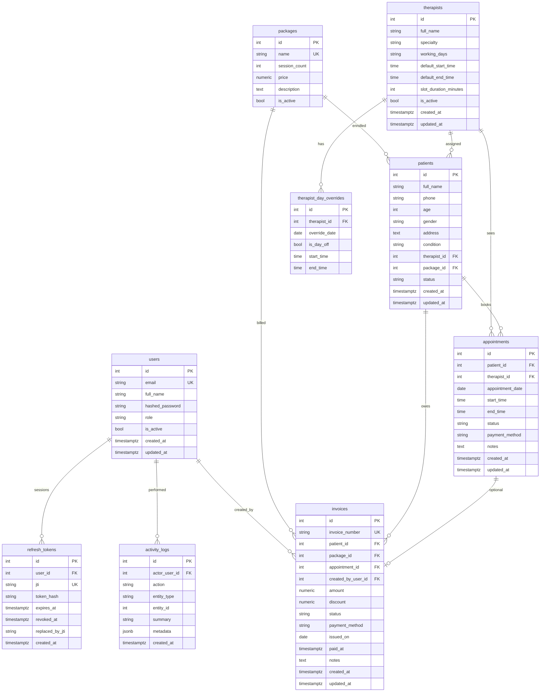

# PhysioDesk — database ERD

PostgreSQL schema for clinic management: auth users, therapists (with day overrides), packages, patients, appointments, invoices, and append-only activity logs.

## Cardinality

| From | To | Cardinality | Notes |
| --- | --- | --- | --- |
| therapists | therapist_day_overrides | 1:N | Unique `(therapist_id, override_date)` |
| therapists | patients | 1:N | Assigned therapist |
| packages | patients | 1:N | Enrolled package |
| therapists | appointments | 1:N | |
| patients | appointments | 1:N | |
| patients | invoices | 1:N | |
| packages | invoices | 1:N | |
| appointments | invoices | 0:1 | Optional link |
| users | invoices | 1:N | `created_by_user_id` |
| users | activity_logs | 1:N | `actor_user_id` |

`activity_logs.entity_id` is a polymorphic reference paired with `entity_type` (not a database foreign key).

Double-booking is blocked by a partial unique index on appointments:  
`(therapist_id, appointment_date, start_time)` where `status <> 'cancelled'`.
